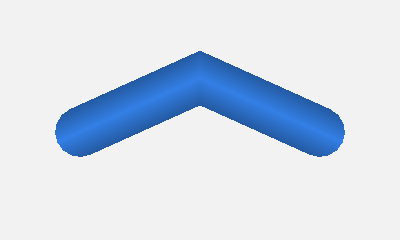
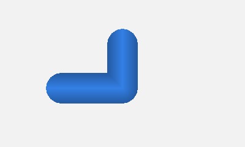
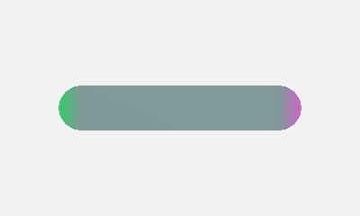

# API Reference

## `createGPULines(device, options)`

Creates a new line renderer instance.

```typescript
function createGPULines(device: GPUDevice, options: GPULinesOptions): GPULines
```

### `GPULinesOptions`

```typescript
interface GPULinesOptions {
  // Shader code
  vertexShaderBody: string;   // WGSL code with struct definition and vertex function
  fragmentShaderBody: string; // WGSL code for fragment output (getColor function)

  // Pipeline state (WebGPU native types)
  colorTargets: GPUColorTargetState | GPUColorTargetState[];  // Format, blending, write mask
  depthStencil?: GPUDepthStencilState;   // Depth/stencil config (omit to disable)
  multisample?: GPUMultisampleState;     // MSAA config (omit for no multisampling)
  primitive?: Partial<GPUPrimitiveState>; // cullMode, frontFace, etc. (topology is fixed)

  // Line rendering options
  join?: 'bevel' | 'miter' | 'round';    // Join style (default: 'miter')
  cap?: 'round' | 'square' | 'butt';     // Cap style (default: 'square')
  miterLimit?: number;         // Miter limit before bevel fallback (default: 4)
  joinResolution?: number;     // Default triangles for round joins (default: 8)
  capResolution?: number;      // Default triangles for round caps (default: 8)
  maxJoinResolution?: number;  // Max join resolution at runtime (default: 8)
  maxCapResolution?: number;   // Max cap resolution at runtime (default: 8)

  // Shader customization
  vertexFunction?: string;     // Name of vertex function (default: 'getVertex')
  positionField?: string;      // Name of position field (default: 'position')
  widthField?: string;         // Name of width field (default: 'width')
  clampIndices?: boolean;      // Clamp indices to [0, N-1] (default: true)
}
```

### `GPULines`

```typescript
interface GPULines {
  getBindGroupLayout(index: number): GPUBindGroupLayout;
  updateUniforms(props: UpdateUniformsProps): void;
  draw(pass: GPURenderPassEncoder, props: DrawProps, bindGroups?: GPUBindGroup[]): void;
  destroy(): void;
}
```

### `DrawProps`

```typescript
interface DrawProps {
  vertexCount: number;              // Number of points in the line
  resolution: [number, number];     // [width, height] of render target in pixels
  miterLimit?: number;              // Override miter limit at runtime
  joinResolution?: number;          // Override join resolution (up to maxJoinResolution)
  capResolution?: number;           // Override cap resolution (up to maxCapResolution)
  skipUniformUpdate?: boolean;      // Skip uniform update (call updateUniforms first)
}
```

## Options

### `join`

Controls how line segments are connected at vertices. Options are `'bevel'`, `'miter'`, and `'round'`.

| `join: 'bevel'` | `join: 'miter'` | `join: 'round'` |
|:---:|:---:|:---:|
|  |  |  |

### `cap`

Controls how line endpoints are rendered. Options are `'round'`, `'square'`, and `'butt'`.

| `cap: 'round'` | `cap: 'square'` | `cap: 'butt'` |
|:---:|:---:|:---:|
|  |  |  |

### `miterLimit`

When using `join: 'miter'`, this controls when sharp angles fall back to bevel joins. Lower values create more bevels. Higher values allow longer miter points. Default is `4`.

| `miterLimit: 1` | `miterLimit: 4` | `miterLimit: 10` |
|:---:|:---:|:---:|
|  |  |  |

### `joinResolution` and `capResolution`

Control the number of triangles used for round joins and caps. Higher values create smoother curves. Default is `8`. Use `maxJoinResolution` and `maxCapResolution` to set upper bounds for runtime adjustment.

| `joinResolution: 2` | `joinResolution: 4` | `joinResolution: 16` |
|:---:|:---:|:---:|
|  |  |  |

### Performance: Vertices Per Instance

The number of vertices processed per instance depends on the join and cap types. Importantly, `maxJoinResolution` only affects vertex count when using `join: 'round'`, and `maxCapResolution` only affects vertex count when using `cap: 'round'`. Non-round join/cap types use fixed, minimal vertex counts regardless of resolution settings.

The formula is: `verticesPerInstance = 2 × (max(capRes2, joinRes2) + 3)`

Where:
- `joinRes2 = maxJoinResolution × 2` for round joins, or `2` for bevel/miter
- `capRes2 = maxCapResolution × 2` for round caps, `6` for square caps, or `2` for butt caps

| Join Type | Cap Type | Vertices Per Instance |
|-----------|----------|----------------------:|
| bevel | butt | 10 |
| miter | butt | 10 |
| bevel | square | 18 |
| miter | square | 18 |
| bevel | round | 2 × (maxCapResolution × 2 + 3) |
| miter | round | 2 × (maxCapResolution × 2 + 3) |
| round | butt | 2 × (maxJoinResolution × 2 + 3) |
| round | square | 2 × (maxJoinResolution × 2 + 3) |
| round | round | 2 × (max(maxJoinResolution, maxCapResolution) × 2 + 3) |

With the default `maxJoinResolution = 8` and `maxCapResolution = 8`, round geometry uses 38 vertices per instance.

If you don't need round joins or caps, you can set `maxJoinResolution` and `maxCapResolution` to any value without affecting performance. Only round geometry uses the resolution settings to determine vertex count.

### Line Breaks

Insert a point with `w = 0` (or `NaN` for any coordinate) to create a line break. This splits the line into separate segments, each with its own end caps.

| Continuous line | With line break (`w: 0`) |
|:---:|:---:|
|  |  |

### Closed Loops

To draw a closed loop where the last point connects back to the first, set `clampIndices: false` and use modular arithmetic in your `getVertex` function. This passes raw indices (including -1 and values ≥ N) to your function as `i32`, allowing custom wrapping logic.

```javascript
const gpuLines = createGPULines(device, {
  // ...
  clampIndices: false,  // Pass raw indices for custom wrapping
  cap: 'butt',          // No caps needed for closed loop
  vertexShaderBody: /* wgsl */`
    @group(1) @binding(0) var<storage, read> positions: array<vec4f>;
    const n = 7;  // Number of unique points

    struct Vertex { position: vec4f, width: f32 }

    fn getVertex(index: i32) -> Vertex {  // Note: i32, not u32
      let p = positions[(index % n + n) % n];  // Wrap indices
      return Vertex(vec4f(p.xyz, p.w), 20.0);
    }
  `,
  // ...
});
```

```javascript
// Draw call: pass n + 1 for vertexCount (n segments for n points)
gpuLines.draw(pass, {
  vertexCount: n + 1,
  resolution: [canvas.width, canvas.height]
}, [dataBindGroup]);
```

### `clampIndices`

Controls how indices are passed to your `getVertex` function:

| `clampIndices` | Index type | Behavior |
|----------------|------------|----------|
| `true` (default) | `u32` | Indices clamped to [0, N-1]. Out-of-bounds triggers automatic end caps. |
| `false` | `i32` | Raw indices passed (-1, N, etc.). User handles wrapping. No automatic caps from bounds. |

When `clampIndices: false`, you can still trigger caps by returning an invalid position (`w = 0` or `NaN`) from `getVertex`.

## Drawing

### `gpuLines.draw(pass, props, bindGroups?)`

Draws lines in a render pass.

- `pass`: `GPURenderPassEncoder` - The active render pass
- `props`: `DrawProps` - Draw properties (see type definition above)
- `bindGroups`: `GPUBindGroup[]` (optional) - User bind groups for groups 1, 2, etc.

### `gpuLines.getBindGroupLayout(index)`

Returns the `GPUBindGroupLayout` for the specified group index. Use this to create bind groups matching the bindings declared in your `vertexShaderBody`.

### `gpuLines.updateUniforms(props)`

Updates internal uniforms without drawing. Useful when recording multiple draw calls in a single render pass. Call with `skipUniformUpdate: true` in subsequent `draw()` calls.

### `gpuLines.destroy()`

Releases GPU resources (pipeline, uniform buffer, bind group).

### Example

```javascript
// Create bind group matching your shader's @group(1) bindings
const dataBindGroup = device.createBindGroup({
  layout: gpuLines.getBindGroupLayout(1),
  entries: [
    { binding: 0, resource: { buffer: myPositionBuffer } },
    { binding: 1, resource: { buffer: myUniformBuffer } }
    // ... match your vertexShaderBody declarations
  ]
});

const pass = encoder.beginRenderPass({ /* ... */ });
gpuLines.draw(pass, {
  vertexCount: points.length,
  resolution: [canvas.width, canvas.height]
}, [dataBindGroup]);
pass.end();
```


## Custom Shaders

The library supports custom WGSL shaders for advanced rendering effects. Provide shader code via the `fragmentShaderBody` and `vertexShaderBody` options.

The library parses your `Vertex` struct to identify the position, width, and varying fields automatically. The library reserves `@group(0)` for its internal uniforms; your shader code should use `@group(1)` and higher for your own data.

### `vertexShaderBody`

The vertex shader body defines how line positions and per-vertex data are computed. You provide bind group declarations (group 1+) for your data, a struct defining the vertex output, and a vertex function that returns the struct given a point index.

The `position` field is a `vec4f` in clip space: `x` and `y` range from -1 to 1, `z` is depth, and `w` must be non-zero for valid points (0 or NaN signals a line break).

```wgsl
@group(1) @binding(0) var<storage, read> positions: array<vec4f>;
@group(1) @binding(1) var<uniform> viewMatrix: mat4x4f;

struct Vertex {
  position: vec4f,  // Clip-space position (w must be non-zero; w=0 or NaN for line breaks)
  width: f32,       // Line width in pixels
  // Additional fields become varyings passed to fragment shader
}

fn getVertex(index: u32) -> Vertex {
  let p = positions[index];
  let projected = viewMatrix * vec4f(p.xyz, 1.0);
  return Vertex(vec4f(projected.xyz, p.w * projected.w), 20.0);
}
```

Your `getVertex` function can read from any source (buffers, textures, procedural) and transform to clip space however you like.

Options for customization include `vertexFunction` (name of your vertex function, default `'getVertex'`), `positionField` (name of position field in struct, default `'position'`), and `widthField` (name of width field in struct, default `'width'`).

Available library uniforms are `uniforms.resolution` (canvas resolution in pixels) and `uniforms.pointCount` (number of points).

### `fragmentShaderBody`

The fragment shader controls how lines are colored. Your code must define a `getColor` function.

```wgsl
fn getColor(lineCoord: vec2f) -> vec4f {
  // Return RGBA color (0-1 range)
  return vec4f(0.2, 0.5, 0.9, 1.0);
}
```

The `lineCoord` parameter provides spatial information about the current fragment (see below).

Any fields in your `Vertex` struct beyond `position` and `width` become varyings, interpolated across the line and passed as additional parameters to `getColor`. For example, if your struct includes `dist: f32`, your function signature becomes `fn getColor(lineCoord: vec2f, dist: f32) -> vec4f`.

If your shader code references `instanceID`, the library will automatically pass two additional parameters, `instanceID: f32` (segment index, negative for end caps) and `triStripCoord: vec2f` (triangle strip vertex coordinates for wireframe visualization). These are useful for debug views showing the internal triangle strip structure.

### `lineCoord` Values

| Component | Segments/Joins | Caps | Description |
|-----------|----------------|------|-------------|
| `lineCoord.x` | 0 | sin(θ) × sign | Always 0 for segments. Varies around the semicircle for caps. |
| `lineCoord.y` | -1 to 1 | cos(θ) × sign | Position across the line. 0 at center, ±1 at edges. |

The `lineCoord` values are designed for SDF (signed distance field) rendering. `length(lineCoord)` gives radial distance from line center (0 at center, 1 at edge). For segments, `length(lineCoord) = abs(lineCoord.y)` since x=0. For caps, `length(lineCoord) = 1` on the outer edge (unit circle).

Note that `lineCoord.x` does NOT provide distance along the line. To implement dashes, add a cumulative distance field to your `Vertex` struct. It will be interpolated and passed to `getColor` as an extra parameter. See the interactive demo's "Stripes" option for an example.

| `lineCoord.x` (0 on segments, varies in caps) | `lineCoord.y` (across line) |
|:---:|:---:|
|  |  |

### Example Shaders

Solid color with edge darkening.
```wgsl
fn getColor(lineCoord: vec2f) -> vec4f {
  let edge = 1.0 - 0.3 * abs(lineCoord.y);
  return vec4f(0.2 * edge, 0.5 * edge, 0.9 * edge, 1.0);
}
```

Cross-line stripes using `lineCoord.y`.
```wgsl
fn getColor(lineCoord: vec2f) -> vec4f {
  let stripe = step(0.0, lineCoord.y);
  return vec4f(stripe * 0.2, 0.5, 0.9 - stripe * 0.4, 1.0);
}
```

SDF stroke with anti-aliasing.
```wgsl
fn linearstep(a: f32, b: f32, x: f32) -> f32 {
  return clamp((x - a) / (b - a), 0.0, 1.0);
}
fn getColor(lineCoord: vec2f) -> vec4f {
  let width = 20.0;
  let strokeWidth = 4.0;
  let sdf = 0.5 * width * length(lineCoord);
  let aa = linearstep(width * 0.5, width * 0.5 - 1.0, sdf);
  let strokeMask = linearstep(
    width * 0.5 - strokeWidth - 0.5,
    width * 0.5 - strokeWidth + 0.5, sdf);
  let fillColor = vec3f(0.4, 0.7, 1.0);
  let strokeColor = vec3f(0.1, 0.3, 0.6);
  let color = mix(fillColor, strokeColor, strokeMask);
  return vec4f(color, aa);
}
```

| Cross-line stripes | Cross-line gradient | SDF stroke |
|:---:|:---:|:---:|
|  |  |  |
